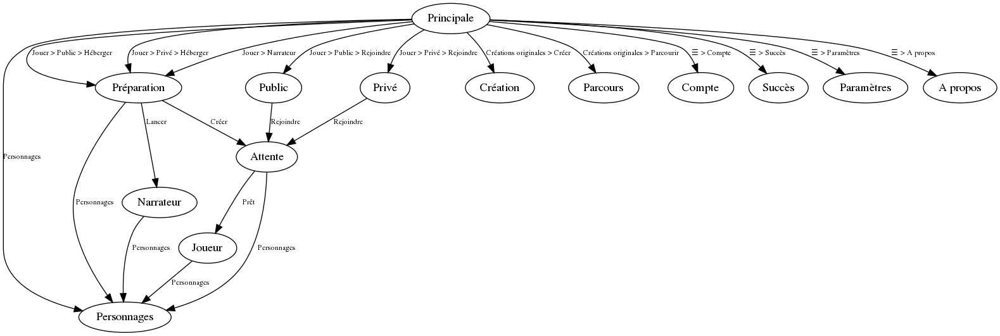

# Loup-garou
Une application pour jouer au jeu Loup Garou

    

---

## Sommaire

* [Le jeu](#Le-jeu)
  * [Synopsis](#Synopsis)
  * [Comment jouer ?](#Comment-jouer-)
  * [Personnages](#Personnages)
* [L'application](#Lapplication)
  * [Modes de jeu](#Modes-de-jeu)
  * [Pages](#Pages)
    * [Architecture](#Architecture)
    * [Fonctionnalités](#Fonctionnalités)
  * [Création de rôles](#Création-de-rôles)
* [Développement](#Développement)
  * [Priorité](#Priorité)
  * [Long terme](#Long-terme)
* [Règles du dépôt](#Règles-du-dépôt)
* [Licence](#Licence)

----

## Le jeu

Le Loup-Garou est un jeu de **collaboration** et de **trahison**, populaire inspiré du jeu de société les Loups-garou de Thiercelieux.

### Synopsis

Les joueurs vivent une triste époque depuis que leur village est attaqué toutes les nuits par une horde de loup-garous. Chaque nuit, les horribles créatures font une victime.

La situation ne peut plus durer : tous les jours, les villageois se rassemblent pour désigner un joueur suspecté d'être un loup-garou, qui sera alors condamné à mort.

Qui, entre les loups-garou et les villageois, parviendront à exterminer le clan adverse en premier ?

### Comment jouer ?

Durant chaque partie, un maître du jeu (MJ) est désigné. Il va alors distribuer les cartes **rôles** face cachée aux joueurs. Le jeu commence par la première nuit, le MJ va appeler tour à tour les rôles, invitant les joueurs à se réveiller pour accomplir leur tâche. Au matin, le MJ annonce qui a été la première victime des loups, le village se rassemble pour condamner un suspect, puis la seconde nuit commence...

### Personnages

Les personnages principaux sont les Loups-garous et les villageois.

La liste des rôles existants est disponible dans [Personnage.md](https://github.com/Relex12/Loup-garou/blob/master/Personnages.md).

Les personnages peuvent provenir du jeu de base, d'une extension du jeu, du site officiel loup-garou en ligne, ou ce sont des créations originales des joueurs.

Comme décrit plus bas, il sera possible de **créer des rôles** directement depuis l'application.

## L'application

L'application **Loup-garou** sera accessible sur smartphone (Android/iOS) et sur navigateur (Firefox, Chrome). Il y aura 3 modes de jeux présents, ainsi qu'une gestion de la communauté.

### Modes de jeu

Les 3 modes de jeux disponibles seront :

* **Public** : un joueur ouvre un salon de jeu, chaque utilisateur pourra alors consulter la liste des salons de jeu et rentrer dans celui de son choix
  * chaque joueur possède l'application
  * il n'y a pas besoin de maître du jeu
  * les joueurs ne se connaissent pas forcément
* **Privé** : un joueur ouvre un salon de jeu et partage aux autres joueurs le code d'entrée du salon, en rentrant ce code d'entrée les joueurs ont accès au salon
  * chaque joueur possède l'application
  * il n'y a pas besoin de maître du jeu
  * à priori les joueurs se connaissent
* **Narrateur** : le maître du jeu crée la partie, précise le nombre de joueurs et leurs noms, puis la partie commence, l'application indique au maître du jeu ce qu'il doit dire et faire
  * seul un joueur doit posséder l'application
  * il doit y avoir un joueur qui fait le maître du jeu
  * les joueurs doivent être au même endroit.

Un mode de jeu où tous les joueurs sont au même endroit et sans narrateur maître du jeu (avec 1 ou N applications installées) semble compliqué à concevoir, mais n'est pas impensable.

### Pages

#### Architecture

Le graphe ci-dessous représente l'architecture des pages des de l'application :

> voir le fichier [Pages.dot](https://github.com/Relex12/Loup-garou/blob/master/pages.dot) pour le code source

* Chaque nœud du graphe représente un page sur l'application.
* Chaque segment représente la la possibilité de passer d'une page à l'autre
  * le libellé des segments est la suite de boutons sur lesquels cliquer pour changer de page (`Bouton` signifie un bouton intitulé Bouton, `Menu > Bouton` signifie un bouton dans un menu déroulant nommé Menu)
* Il est toujours possible de naviguer en arrière à l'aide du bouton Arrière (sur smartphone et sur navigateur)

#### Fonctionnalités

Voici la description des fonctionnalités de chaque page :

* **Principale** : Page accueil de l'application, possède le menu déroulant `Jouer`, le bouton `Personnages`, le menu déroulant `Créations originales` et le menu latéral `☰`. Le menu`Jouer` possède les menus déroulants `Public` et `Privé` qui possède chacun les boutons `Héberger` et `Rejoindre`. Le menu `Créations originales` possède les boutons `Créer` et `Parcourir`. Le menu latéral `☰` possède les boutons `Compte`, `Succès`, `Paramètres` et `A propos`.
* **Personnages** : Liste et descriptions de tous les rôles de base, ainsi que de tous les rôles likés si l'utilisateur possède un compte. Si la page est ouverte depuis une autre page que Principale, alors elle s'affiche comme une fenêtre par dessus la page précédente.
* **Préparation** : Demande au créateur de la partie des informations comme le nombre de joueurs, les rôles à distribuer. La page peut changer légèrement selon le bouton qui a été utilisé : possède le bouton `Créer`  depuis `Public > Héberger` ou `Privé > Héberger` , possède le bouton `Lancer` depuis `Narrateur`.
* **Public** : Liste des salons publics ouverts non complets, avec la description du créateur. Possède le bouton `Rejoindre`.
* **Privé** : Champs pour le code d'entrée dans le salon. Possède le bouton `Rejoindre`.
* **Attente** : Les utilisateurs peuvent échanger textuellement, le créateur peut modifier la préparation de la partie. Possède le bouton `Prêt`.
* **Narrateur** : Déroulement de la partie : donne les indications au maître du jeu pour l'aider. Possède le bouton `Quitter` et, enfin de partie `Rejouer`.
* **Joueur** : Déroulement de la partie pour chaque joueur. Permet d'échanger la journée, de faire le vote du village et de réaliser les actions du rôle la nuit. Enfin de partie, possède les boutons `Quitter` et `Rejouer`.
* **Création** : Possède le canvas de création de personnage, ainsi que les bouton `Sauvergarder` et `Publier`. Le canvas et la création de personnage sont décrits ci-dessous.
* **Parcours** : Liste les personnages créés par l'utilisateur ainsi que par d'autres, possibilité d'effectuer une recherche et de filtrer, de liker et de proposer des modifications.
* **Compte** : Permet à l'utilisateur de modifier son nom d'utilisateur, son pseudo, son apparence ou image. Si l'utilisateur n'a pas de compte, la page affichée est une page de création de compte.
* **Succès** : Liste les succès déverrouillées par l'utilisateur. Si l'utilisateur n'a pas de compte, la page affichée est une page de création de compte. En attendant, les succès sont enregistrés dans l'application mais pas affichés.
* **Paramètres** : Permet de modifier le niveau du son et de la musique, la sauvegarde du compte avec Google Play.
* **A propos** : Texte statique présentant le travail des développeurs, le développement et incitant au don.

### Création de rôles

Pour **créer des rôles**, l'utilisateur pourra utiliser l'environnement de programmation par blocs présent sur la page **Création** décrite au dessus. Sur cette page, il y aura un environnement **Blockly** qui permettra de programmer soit-même des nouveaux personnages. Les blocs utilisables seront les blocs prédéfinis d'algorithmie ainsi que, et surtout, les blocs spéciaux créés pour développer un personnage.

La liste des blocs spéciaux est décrites dans [Blocks.md](https://github.com/Relex12/Loup-garou/blob/master/Blocks.md).

L'utilisateur peut à tout moment publier, modifier, supprimer ou retirer ses personnages.

## Développement

### Priorité

Le premier mode de jeu à développer est le mode Narrateur. Il n'y a pas besoin d'effectuer du développement backend, tout le calcul sera fait directement depuis l'application.

Les rôles de bases (i.e. ceux présents dans le jeu de base, les extensions et sur le site officiel) seront implémentés grâce à la programmation par bloc disponible dans l'application. Autrement dit, ces rôles vont servir à débuguer le moteur de programmation par blocs.

L'application sera développée en Dart avec le framework Flutter et l'IDE Android Studio, afin d'être responsive nativement et cross-plateforme  (Android / iOS et navigateur). L'architecture de l'application suivra le modèle Modèle-Vue-Contrôleur.

Le contenu de l'application sera en français, dans la mesure où le jeu Loup-Garou est connu principalement dans le milieu francophone.

### Long terme

Les modes de jeux Public et Privé arriveront dans un second temps, dans la mesure où ils nécessitent du développement backend, et donc surtout l'administration d'un ou plusieurs serveurs publics.

La traduction vers d'autres langues sera faite si l'application acquiert une grosse communauté.

Une application Windows pourra être réalisée si nécessaire (supporté par Flutter).

## Règles du dépôt

* le code, les commentaires, les commits, **tout est rédigé en français**
* une fois que l'application est fonctionnelle, le dépôt pourra être traduit en anglais

## Licence

Comme ce projet est en conception, le dépôt est libre d'accès à la  communauté GitHub, sous la seule licence MIT, qui n'est pas trop  restrictive.
